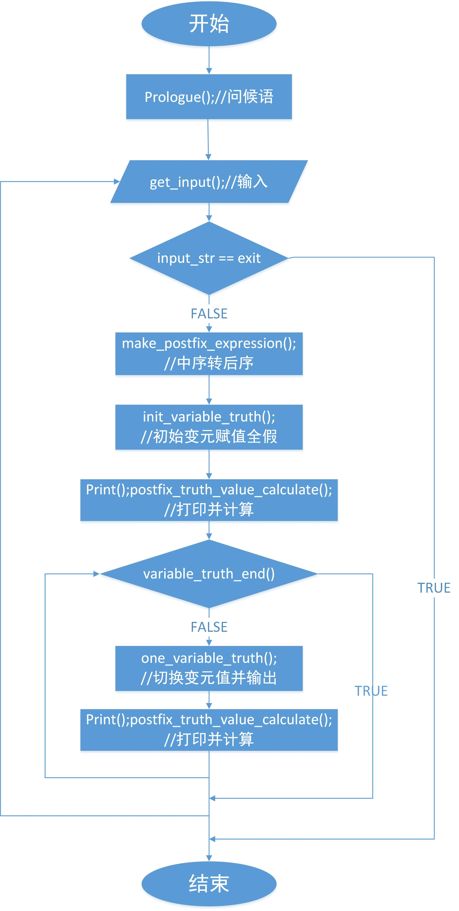

# Truth table calculator


## 1. Basic ideas

1. 输入解析（Analyze input str） ->
2. 变元赋值（Assign value to argument） ->
3. 计算真值（Calculate the true value） ->
4. 打印结果（Print results）


## 2. Assignment principle

模拟二进制加一（Analog binary plus one）

就像这样（like this）：

| p | q | r |
|---|---|---|
| 0 | 0 | 0 |
| 0 | 0 | 1 |
| 0 | 1 | 0 |
| 0 | 1 | 1 |
| 1 | 0 | 0 |
| 1 | 0 | 1 |
| 1 | 1 | 0 |
| 1 | 1 | 1 |


## 3. Calculation method

### 3.1 Postfix expression

Windows:
```bash
chcp 65001
g++ stack+postfix.cpp && a.exe
```

Linux:
```bash
g++ stack+postfix.cpp && ./a.out
```

Postfix expression（后缀表达式） also known as [Reverse Polish notation (RPN)](https://en.wikipedia.org/wiki/Reverse_Polish_notation)（逆波兰）

Cal:

1. 从左至右扫描表达式（Scan the expression from left to right）.
2. 遇到变元时，将变元压入堆栈（If the current is argument, push its number onto the stack）.
3. 遇到运算符时，弹出栈顶的两个数，用运算符对它们做相应的计算，并将结果入栈（Else if the current is operator, pop the two numbers on the top of the stack, use the operator to calculate them accordingly, and then push the result onto the stack）.
4. 重复上述过程，最后运算得出的值即为表达式的结果（Repeat the above process, the last value in the stack is the result of the expression）.

Infix-2-postfix:

1. 中缀转后缀（Create a operator stack）
2. 顺序扫描中序表达式（Scan the infix expression from left to right）
    1. 变元（if argument）， 直接加入后缀表达式（Add it to the postfix expression directly）
    2. 运算符（if operator）,
        1. "(" 直接入栈。（if "(", push "(" onto the stack.）
        2. ")" 将运算符栈中的元素依次出栈放入后缀表达式，直到遇到"("，并将"("出栈。（if ")", pop the operators in the stack and Add them to the suffix expression in order, until encountering "(" and pop "(".）
        3. 运算符，如果运算符栈栈顶元素比当前运算符优先级高或相等，则出栈直到遇到比当前运算符优先级低的符号或者"("，并将当前符号入栈。（if other operators, If the top element of the stack is higher or equal to the priority of the current operator, then the stack is popped until it encounters a lower priority operator or "(". And push the current operator onto the stack.）
3. 扫描完后, 将栈中剩余符号依次输出（After scanning, the remaining operator in the stack are output sequentially）

`stack+postfix.cpp` workflow:




### 3.2 Recursive calculation

Windows:
```bash
chcp 65001
g++ binaryTree+recursion.cpp && a.exe
```

Linux:
```bash
g++ binaryTree+recursion.cpp && ./a.out
```


`binaryTree+recursion.cpp` workflow:


## 4. Reference

basic: [http://hwdong.com/ds/](http://hwdong.com/ds/)

`stack+postfix.cpp`: [http://blog.csdn.net/iSpeller/article/details/8009628?locationNum=2&fps=1](http://blog.csdn.net/iSpeller/article/details/8009628?locationNum=2&fps=1)

`binaryTree+recursion.cpp`: [http://blog.csdn.net/patrick_lyle/article/details/63250699](http://blog.csdn.net/patrick_lyle/article/details/63250699)